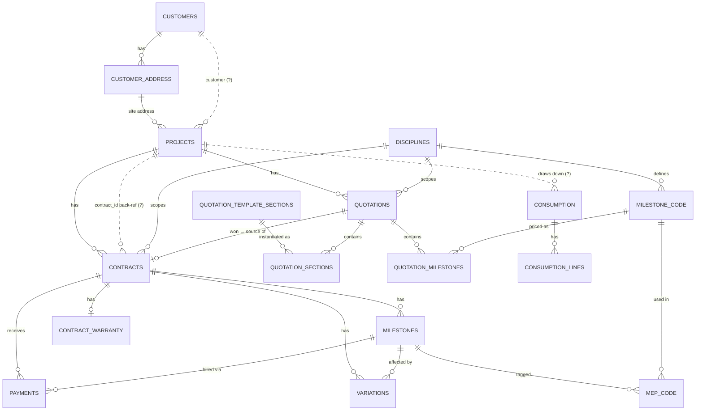

# MEP Module — Data Model & Quotation Editor (design capture)

> **Status:** Design capture — **not yet implemented.** Table/column names below are transcribed from the source mockups and are provisional; several are marked *TBD* or *(to confirm)*, and the naming/shape decisions in [§6](#6-open-decisions--naming) still have to be made before any migration is written.
> **Branch:** `feature/mep`
> **Captured:** 2026-08-22
> **Source artifacts:** `D:\ERP\MEP DB plan\mep_erp_db_erd_v1.html` (interactive ERD v4) · `D:\ERP\MEP DB plan\quotation_editor_mockup.html` (quotation editor mockup)

This module is the **MEP-contractor realization of the long-planned Contracts module** (`Ideas/Contracts Module.txt`; dormant permission/route stubs already exist — see [§5](#5-mapping-to-existing-mms-code)). It manages the full lifecycle for a Mechanical / Electrical / Plumbing contractor: build a **quotation** for a project (with private cost/profit math), win it, convert to a **contract**, then track **milestones**, **payments**, **variations** (change orders), and a **completion warranty** — while **consumption/COGS** draws actual cost down against the project.

---

## 1. Lifecycle overview

```
Customer ──> Project ──> MEP Quotation (per discipline)
                              │  draft → sent → won → lost
                              ▼ (won)
                          Contract ──┬── Milestones (billing: quoted vs actual cost)
                                     ├── Payments (against contract / milestone)
                                     ├── Variations (change orders, affect a milestone)
                                     └── Contract Warranty (starts at completion)

Consumption / COGS ── tagged to project + milestone ──> feeds "actual cost" back into Milestones
```

The **quotation** is where internal labour/material/profit is computed privately; the customer-facing document falls out of the same record with the cost columns hidden ([§4](#4-the-quotation-editor)).

---

## 2. Entity reference

Transcribed from the ERD. Legend: **PK** primary key · **FK** foreign key · *TBD* columns not yet specified in the source · **⚑ internal** = present on the record but hidden from the customer-facing quotation PDF · edges marked *(to confirm)* are dashed in the source ERD.

### 2.1 Customer domain

**`customers`** *(domain — columns TBD)*
- **PK** `id`
- *TBD:* `name`, `phone`, `email`, `tax_id?`

**`customer_address`**
- **PK** `id`
- **FK** `customer_id → customers`
- *TBD:* `line1`, `city`, …

> ⚠️ MMS already has `customers` + `customer_addresses` (Qatar blue-plate shape). This ERD's placeholders should be reconciled to the existing tables, **not** rebuilt — see [§5](#5-mapping-to-existing-mms-code).

### 2.2 Project domain

**`projects`**
- **PK** `id`
- `project_number`
- **FK** `site_address_id → customer_address`
- **FK** `contract_id` *(to confirm — back-reference)*
- `PIN`
- **FK** `customer_id` *(to confirm)*
- *TBD:* `status`, dates…

**`disciplines`** *(lookup)*
- **PK** `id`
- `name`, `prefix`

### 2.3 Quotation domain (contract-source)

**`quotations`** *("MEP Quotations")*
- **PK** `id`
- **FK** `project_id → projects`
- **FK** `discipline_id → disciplines`
- `quotation_number`, `revision`
- `PIN`, `amount`, `valid_until`
- `status` — `draft` / `sent` / `won` / `lost`
- `issued_date`, `updated_at`
- `generated_pdf_url`

### 2.4 Contract domain

**`contracts`**
- **PK** `id`
- **FK** `project_id → projects`
- **FK** `discipline_id → disciplines`
- **FK** `quotation_id → quotations` *(source — the won quotation)*
- `contract_value`
- `status`
- `start_date`, `completion_date`, `expected_completion_date`
- `signed_contract_pdf` (URL)

**`contract_warranty`**
- **PK** `warranty_id`
- **FK** `contract_id → contracts`
- `warranty_months`
- `start_date` *(= contract completion date)*
- `end_date`, `status`

**`variations`** *(change orders)*
- **PK** `id`
- **FK** `contract_id → contracts`
- **FK** `affected_milestone_id → milestones`
- `amount`, `details`, `status`
- `date_approved`, `date_reached`
- `approval_pdf` (URL)

### 2.5 Milestone / financial domain

**`milestones`** *("Project Milestones")*
- **PK** `id`
- **FK** `contract_id → contracts`
- `milestone` (name), `description`
- `amount`, `status`
- `quotation_material_cost`, **`actual_material_cost`**
- `quotation_labour_cost`, **`actual_labour_cost`**

> The **quoted vs. actual** cost pair is the crux: the *actual* material/labour is exactly what `consumption` / `cogs_entries` already compute per milestone in MMS. This is the strongest reason to converge the two milestone models ([§6](#6-open-decisions--naming)).

**`milestone_code`** *(lookup)*
- **PK** `code`
- **FK** `discipline_id → disciplines`
- `description`

**`mep_code`** *(junction: milestone ↔ milestone_code)*
- **FK** `milestone_id → milestones`
- **FK** `code → milestone_code`

**`payments`**
- **PK** `id`
- **FK** `contract_id → contracts`
- **FK** `milestone_id → milestones`
- `amount`, `payment_date`, `payment_method`, `notes`

### 2.6 Quotation-template domain (the editor's data)

**`quotation_template_sections`** *("QTS")*
- **PK** `id`
- `order`
- `header` (e.g. Terms, Warranty)
- `default_body` (rich text)
- `is_removable` (bool)

**`quotation_sections`** *("QS" — the instantiated, edited copy on a quotation)*
- **PK** `id`
- **FK** `quotation_id → quotations`
- **FK** `template_section_id → quotation_template_sections` *(nullable — custom sections have none)*
- `order`, `header`
- `body_text` (edited copy)

**`quotation_milestones`** *("QMILES" — the structured milestone rows inside a quotation)*
- **PK** `id`
- **FK** `quotation_id → quotations`
- `s_no` (display order)
- `description` — **customer-visible**
- **FK** `milestone_code_id → milestone_code` — ⚑ internal
- `calculated_labour` — ⚑ internal
- `calculated_material` — ⚑ internal
- `profit_pct` — ⚑ internal
- `amount` — ⚑ internal *(customer sees this value, not the breakdown)*

### 2.7 Operations / consumption domain

**`consumption`** *(columns TBD)*
- **PK** `id`
- *TBD:* project/contract ref, date, ref…

**`consumption_lines`** *("Consumption Line Items" — columns TBD)*
- **PK** `id`
- **FK** `consumption_id → consumption`
- *TBD:* item, qty, unit, price…

> ⚠️ MMS already has `consumption_entries` + `consumption_lines` + `cogs_entries`, live and tagged by project + discipline + milestone. Reuse, don't rebuild — see [§5](#5-mapping-to-existing-mms-code).

---

## 3. Relationships

Solid = confirmed in the source ERD. Dashed = flagged "to confirm" by the ERD author.



**To-confirm edges (dashed in source):**
- `customers → projects` — is a project owned directly by a customer, or only via its site address / contract?
- `projects ↔ contracts` — the ERD carries FKs in *both* directions (`contracts.project_id` **and** `projects.contract_id`); one of these is redundant and must be resolved.
- `projects → consumption` — does consumption attach to the project, the contract, or the milestone? (In current MMS it attaches to the project pool + discipline + milestone tags.)

**Note on the two milestone→code paths:** contract-side `milestones` link to `milestone_code` through the **`mep_code` junction** (many codes per milestone), while quotation-side `quotation_milestones` carry a **direct** `milestone_code_id`. Confirm whether that asymmetry is intentional.

---

## 4. The Quotation Editor

A document-style editor (`quotation_editor_mockup.html`) with one load-bearing idea: **two audiences from one record.**

**Header meta:** `quotation_number`, `revision`, `discipline` (MEP / Mechanical / Electrical / Plumbing), `status` (Draft / Sent / Won / Lost), `project_number`, `PIN`, `issued_date`, `valid_until`, `customer`, and a **read-only** `site_address` auto-filled from the customer's address.

**Sections** — reorderable, instantiated from `quotation_template_sections`:
- **Free-text / editable** (rich text): *Introduction & Scope*, *Payment Terms*, *Warranty & DLP*, *Terms & Conditions*, plus **+ Add custom section** (a `quotation_section` with no template link).
- **Structured**: the **Project Milestones** table.

**Milestones table — internal vs. customer view (the key behaviour):**

| Column | Visible to customer? |
|---|---|
| `#` (s_no) | ✅ |
| Description | ✅ |
| Milestone Code | ⚑ internal only |
| Calc. Labour | ⚑ internal only |
| Calc. Material | ⚑ internal only |
| Profit % | ⚑ internal only |
| Amount | ✅ |

- A top toggle switches **Internal view ↔ Customer view**; in customer view the ⚑ columns and the internal totals are hidden (and must be omitted from the generated customer PDF).
- **Amount formula:** `amount = (labour + material) × (1 + profit% / 100)`.
- **Totals:** Labour and Material subtotals (⚑ internal) + **Grand Total** (customer-visible).
- Autosave, dirty/saved status, reset-to-defaults.

> The customer never sees cost breakdown or margin — only description + amount + grand total. This internal/customer split is the single most important thing to get right in the build.

---

## 5. Mapping to existing MMS code

Verified against the codebase on 2026-08-22 (branch `feature/mep`, off `deploy/warehouse-shipping`). Three buckets:

| Entity | DB today | UI / hook today | Verdict for MEP |
|---|---|---|---|
| **Customers / Address** | `customers`, `customer_addresses` (Qatar blue-plate), `customer_blocks` | `master-data/customers`; customer-scoped hooks (no plain `useCustomers`) | ♻️ **Reuse** |
| **Consumption / COGS** | `consumption_entries`, `consumption_lines`, `cogs_entries` | `/consumption` + dialogs; `useConsumption`, `useCogsBreakdown` | ♻️ **Reuse** (source of "actual cost") |
| **Product warranty** | `warranty_policies` / `warranty_records` / `warranty_claims` | `/sales/warranties`; `useWarranty*` | ♻️ **Separate** — this is product/sales warranty, *not* the contract warranty below |
| **Projects** | `projects` (`20260824000800`), pool model (`20260912000000`) | tab under `master-data/warehouses`; `useProjects` | ⚠️ **Reconcile** — exists as a *stock-pool* model, not contract-linked |
| **Disciplines** | `disciplines` (`20260824000700`) + `project_disciplines` junction | inline only (no admin page); `useDisciplines` | ⚠️ **Reconcile** — no `prefix`, no `milestone_code` yet |
| **Milestones** | `project_milestones` (`20260829000000`) — free-text label, actuals from consumption | `MilestoneManager`; `useProjectMilestones` | ⚠️ **Reconcile** — cost-tag today; ERD wants code + quoted/actual + billing |
| **Contracts** | baseline `contracts` / `contract_services` / `contract_milestones` / `contract_payments` — **FM / preventive-maintenance shape** | none built; only perm + route stubs | 🆕 **Net-new** (wrong shape; dormant) |
| **Contract warranty** | — | — | 🆕 **Net-new** |
| **Variations** | — (only a P&L landed-cost *variance* line, unrelated) | — | 🆕 **Net-new** |
| **MEP Quotation + editor** | no `quotation_sections` / `_template_sections` / `_milestones` | — | 🆕 **Net-new** |
| **Milestone billing / Payments** | `payments` = AR/AP against invoices/bills; `contract_payments` dormant | `usePayments` + kin | 🆕 **Net-new** (milestone→billing link) |

**Already-present scaffolding we can activate (don't rebuild):**
- Permission keys: `contracts.access`, `contracts.quotations.*`, `contracts.live.*`, `contracts.activate` — `src/lib/permissions.ts:473-494`.
- Route gates: `/contracts`, `/contracts/quotations`, `/contracts/create-quotation` — `src/lib/route-permissions.ts:48-50`.
- Query-key stub — `src/lib/queryKeys.ts:86`.
- Nav: a new top-level dropdown would be added to `NAV_ITEMS` in `src/components/layout/nav-config.ts` (current dropdowns: Master Data · Reports · Purchase & Sales · Operations). A new route group would sit under `src/app/(dashboard)/` alongside `consumption`, `sales`, `purchase`, `warehouse`, `master-data`, `reports`.

> Naming caution: MMS already exposes permission keys and a route under **`contracts`**. Whether this module ships as `contracts` (activating those) or as a distinct `mep` section is part of the naming decision in §6.

---

## 6. Open decisions & naming

**D1 — Milestone/project convergence (the big one).**
Does the MEP milestone **converge with** the existing VWh `project_milestones` (quotation milestone → on win becomes the contract/project milestone → `actual_*` costs stream in from tagged `consumption`/`cogs_entries` — one unified object with a quoted-vs-actual view), or run as a **parallel** MEP-only model? This decision drives the entire schema. The quoted-vs-actual columns in `milestones` strongly point toward convergence.

**D2 — Naming collisions.** Pick distinct names before writing any migration:
- **"Quotation"** is already used 4 ways in MMS: sales-order `status='quotation'` (live), purchasing `rfq_quotes` (live), dormant `order_quotations`, and `contracts.quotation_number`. The MEP quotation is a **5th** concept → needs a distinct name (e.g. `mep_quotations`).
- **"Milestone"** already means a consumption cost-tag (`project_milestones`). Reusing the word for a billing line needs care (tie to D1).
- **Module home:** activate the existing `contracts` permission/route family, or introduce a separate `mep` section?

**D3 — The ERD's own to-confirm edges** (see [§3](#3-relationships)): resolve the `projects ↔ contracts` double FK; decide whether `consumption` attaches to project / contract / milestone; decide the `customers → projects` direct link.

**D4 — Milestone→code cardinality:** contract-side uses the `mep_code` junction (many-to-many) while quotation-side uses a single `milestone_code_id`. Confirm intended cardinality on each side.

---

## 7. Source artifacts

| File | What it is |
|---|---|
| `D:\ERP\MEP DB plan\mep_erp_db_erd_v1.html` | Interactive ERD v4 — draggable entity cards + relationship edges (solid = confirmed, dashed = to confirm). Source for [§2](#2-entity-reference) and [§3](#3-relationships). |
| `D:\ERP\MEP DB plan\quotation_editor_mockup.html` | Quotation editor mockup — meta fields, reorderable template sections, structured milestones table with the internal/customer view toggle. Source for [§4](#4-the-quotation-editor). |

*This document captures the source design only. It becomes the input to a brainstorming → spec → implementation-plan pass once the §6 decisions are made.*
