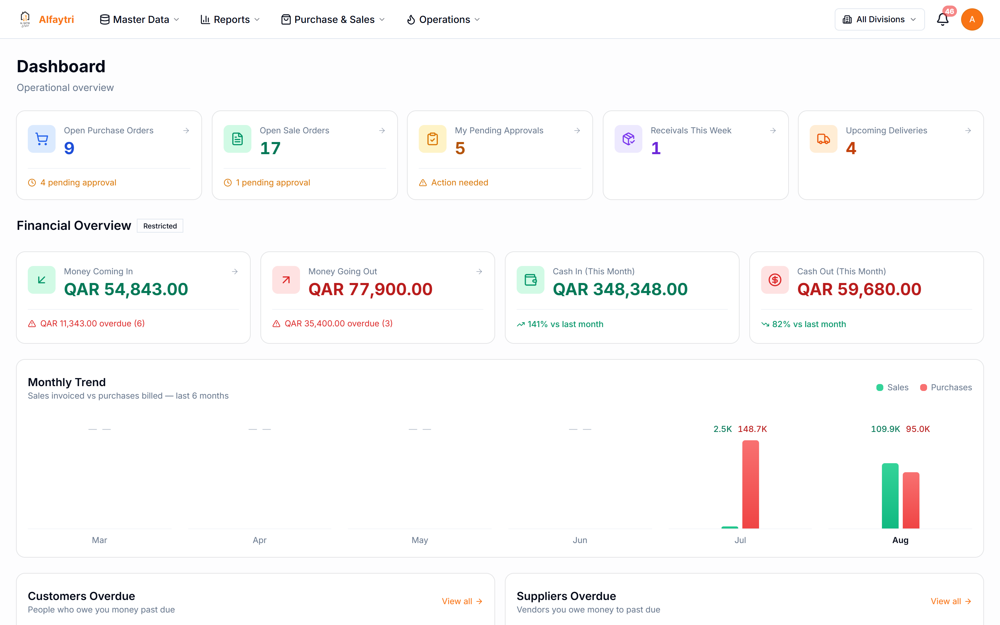
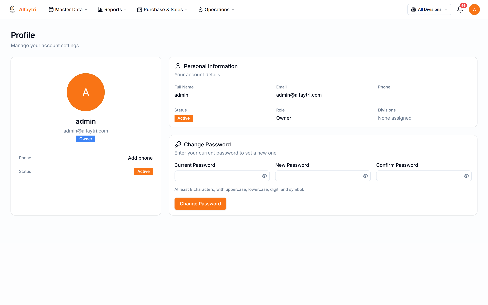

# 1. Getting Started

## 1.1 Logging in

Open the app in your browser and sign in with the **Username** and **Password** your administrator gave you. If your login doesn't work, contact your administrator — passwords are managed by them, not self-service.

## 1.2 Finding your way around

Every page shares the same top bar:

- **Alfaytri (top left)** — click the logo any time to return to the Dashboard.
- **The four menus** — **Master Data**, **Reports**, **Purchase & Sales**, and **Operations**. Hover or click a menu to open its list of pages. (You only see the menus and pages your role is allowed to open.)
- **All Divisions (top right)** — filter the whole app to a single division, or leave it on *All Divisions* to see everything you have access to.
- **The bell** — your notifications. A number badge means you have unread items (approvals waiting for you, deliveries due, etc.).
- **Your initial (far right)** — opens your account menu, where you can view your profile and sign out.

## 1.3 The Dashboard

The Dashboard is your daily overview. It has three parts:

**Operational cards (top row)** — quick counts with a one-click jump to the full list:

- **Open Purchase Orders** — POs not yet fully received, with how many are waiting for approval.
- **Open Sale Orders** — active customer orders, with how many are waiting for approval.
- **My Pending Approvals** — items waiting for *you* to approve. "Action needed" means you're holding something up.
- **Receivals This Week** — incoming goods expected this week.
- **Upcoming Deliveries** — customer deliveries coming up.

**Financial Overview** — money at a glance (this section is marked *Restricted*, so it only appears if your role can see financials):

- **Money Coming In / Going Out** — receivables and payables, with the overdue amount called out in red.
- **Cash In / Cash Out (This Month)** — actual cash movement, compared to last month.

**Monthly Trend** — a 6-month bar chart of sales invoiced vs. purchases billed, plus **Customers Overdue** and **Suppliers Overdue** lists at the bottom so you can act on the most pressing accounts.

> **Tip:** the operational cards are the fastest way into your work — click **Open Purchase Orders** to jump straight to the PO list, **My Pending Approvals** to clear your approval queue, and so on.

## 1.4 Your profile

Click your initial at the top right to open your account, where you can review your profile details and **sign out**.

