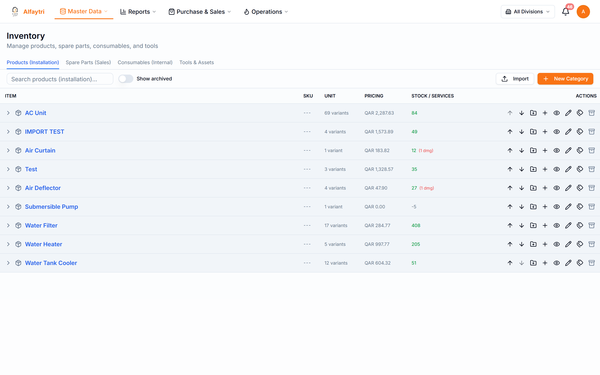
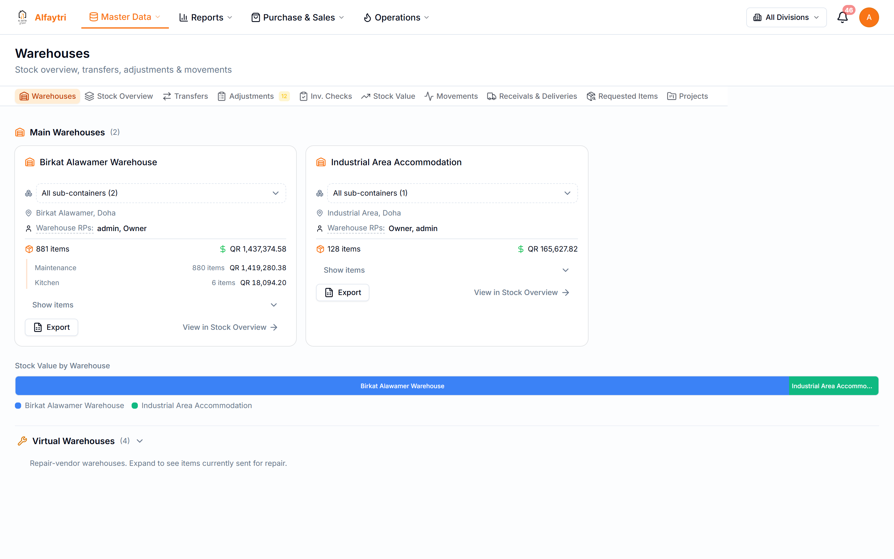
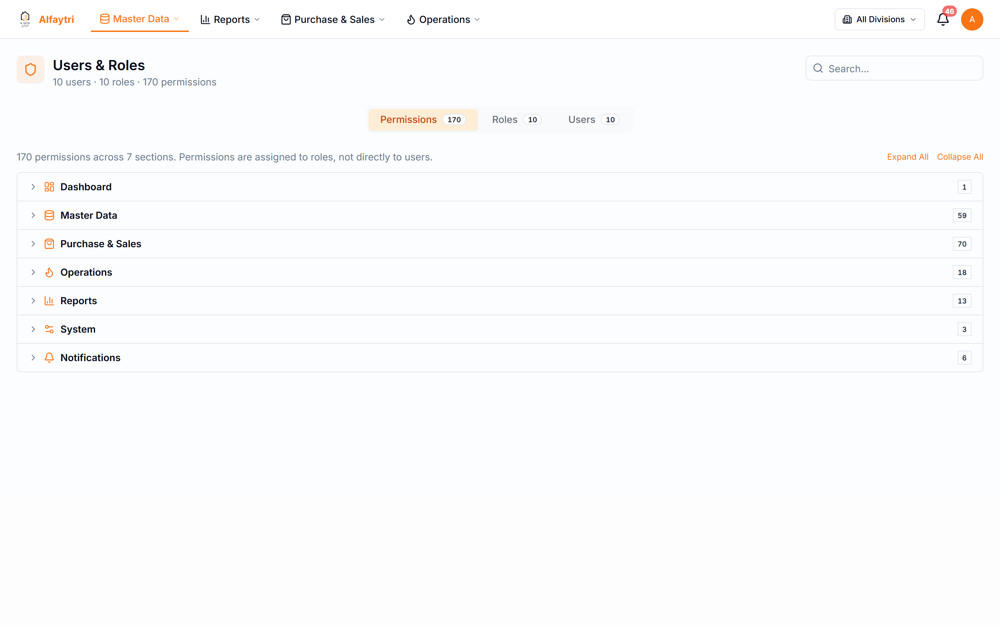
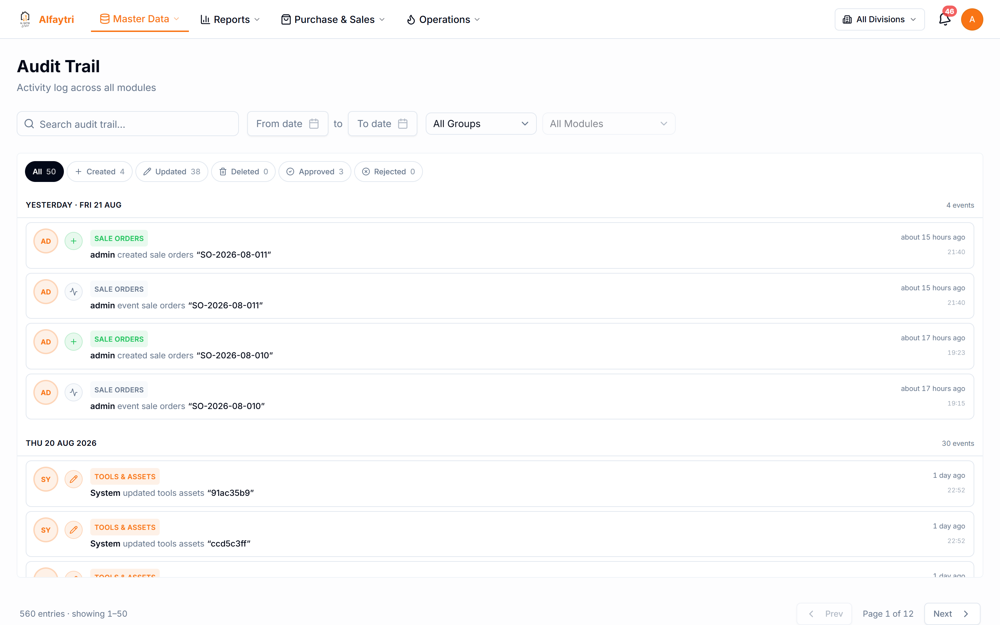
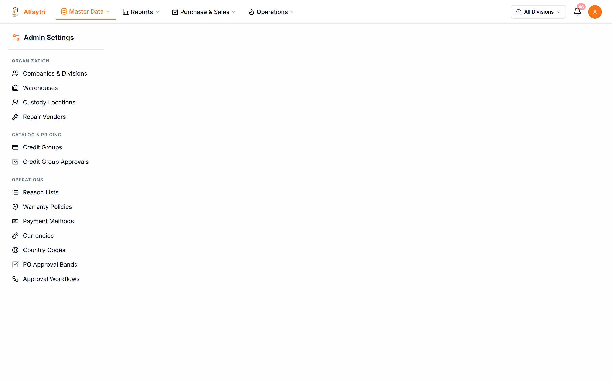
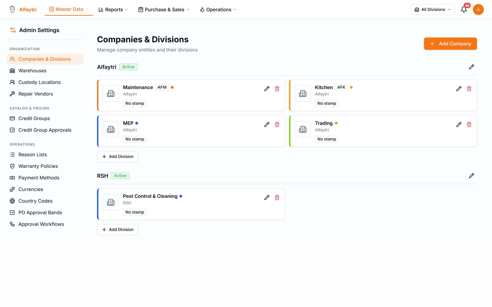
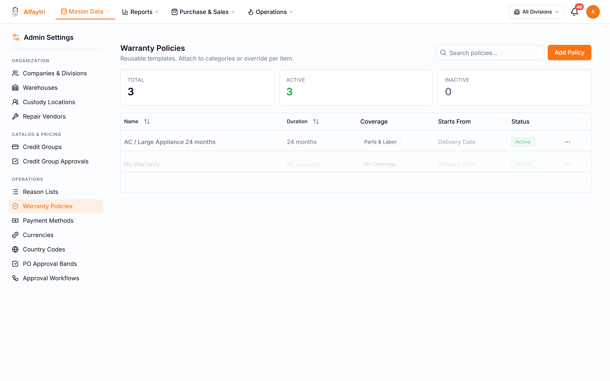
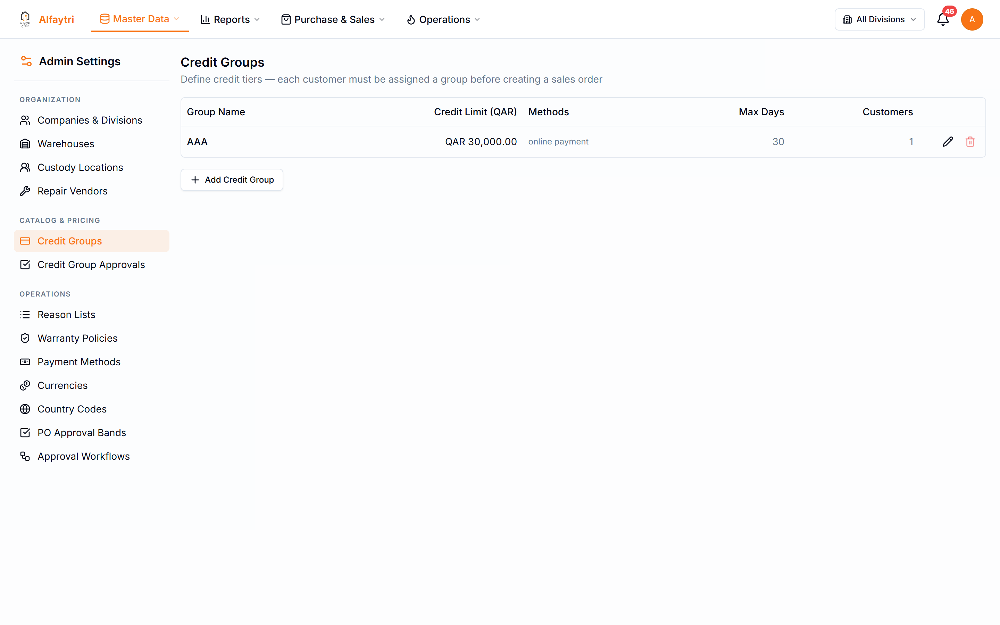
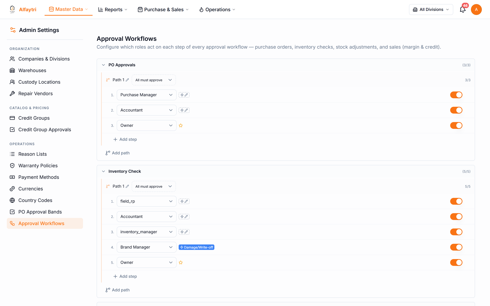

# 2. Master Data

Master Data is the foundation the rest of the system builds on — your item catalogue, warehouses, people, and the settings that control approvals, credit, and warranties. You'll set most of this up once and then maintain it as things change.

## 2.1 Inventory

**Master Data → Inventory**

Your full product catalogue, organised as a category tree. Expand a category to see its items; expand an item to see its brand/origin variants with stock, cost, and selling price.

- **Browse** by expanding the tree, or **search** to jump to an item.
- **Item types** are grouped (products, consumables, spare parts).
- Each variant shows its **origin** (country), on-hand stock per division, average cost, and selling price.
- Open an item to **edit** its details, add **brands/origins**, or start a **receival**.

> **Who can do this:** viewing the catalogue needs *Inventory* view; seeing cost/price columns needs the pricing/cost permission (they're hidden otherwise).

## 2.2 Warehouses

**Master Data → Warehouses**

Your physical and virtual storage locations and their sub-containers (the division-specific pockets stock lives in).

Use this to see stock value and movement per warehouse, and to manage sub-containers. Repair-vendor virtual warehouses (where items go while out for repair) also appear here.

## 2.3 Users & Roles

**Master Data → Users & Roles**

Manage the people who use the system and what each of them can do.

- **Users** — add a person, set their divisions, and assign a role.
- **Roles** — each role is a checklist of permissions. Tick a permission to grant it; untick to hide that page or action. This is where you'd grant, for example, **Warranties** view or **Warranty Claims** manage to the staff who handle warranties.

> **Who can do this:** managing users and roles is an administrator function.

## 2.4 Audit Trail

**Master Data → Audit Trail**

A searchable history of who changed what and when — orders, approvals, stock movements, consumption, transfers, and more. Filter by module and page through the history to investigate a change.

## 2.5 Admin

**Master Data → Admin**

The settings area. A sidebar lists the configuration pages; changes here affect how the whole system behaves, so it's normally limited to administrators.

The main settings pages:

**Companies** — your legal entities and their divisions (the divisions used everywhere else).

**Warranty Policies** — the coverage templates (duration, what's covered) applied to items; this drives the warranties issued at delivery.

**Credit Groups** — customer credit tiers and limits, and the approval needed to change them.

**Approval Workflows** — the value thresholds and approver chains for purchase and sale orders.

Other settings pages available here (screenshots kept in the asset library for reuse): **Warehouses**, **Custody**, **Repair Vendors**, **Credit-Group Approvals**, **Reason Lists**, **Payment Methods**, **Currencies**, **Country Codes**, and **Approval Settings**.
