# 3. Purchase

Buying goods follows one path from start to finish:

**Supplier → Purchase Order → Approval → Receival → Bill**, with **Returns / Debit Notes** when something has to go back, and the **Aging Report** to keep track of what you owe.

Alongside this core flow, **Shipments**, **Landed Costs**, and the **Dead Stock Report** help you track goods in transit, get item costs right, and spot stock that isn't moving.

You'll find all of these under the **Purchase & Sales** menu.

## 3.1 Suppliers

**Purchase & Sales → Suppliers**

Your list of vendors. Add a supplier here before you can raise a purchase order to them.

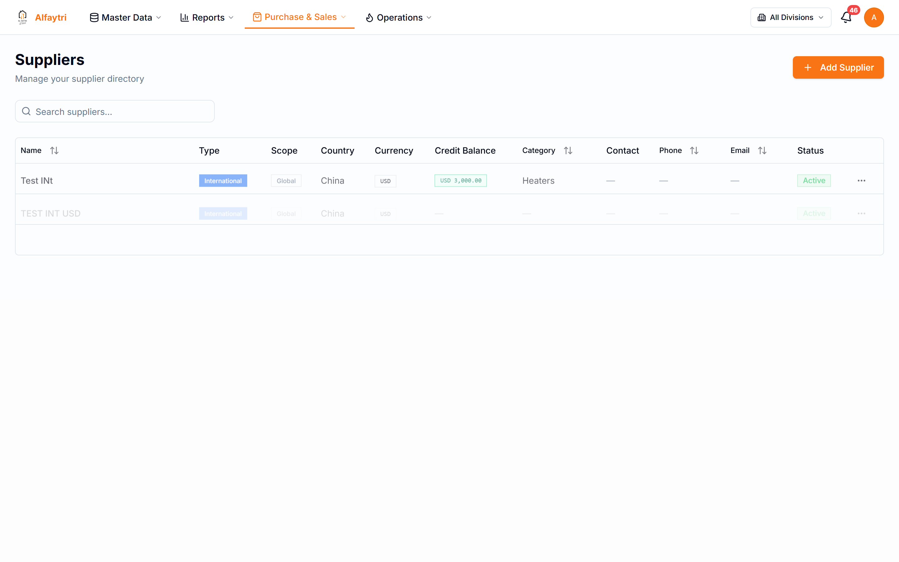

To add one, click **Add Supplier**, fill in the name and contact details (phone uses the country-code selector), and save. Existing suppliers can be opened to edit their details or review their history.

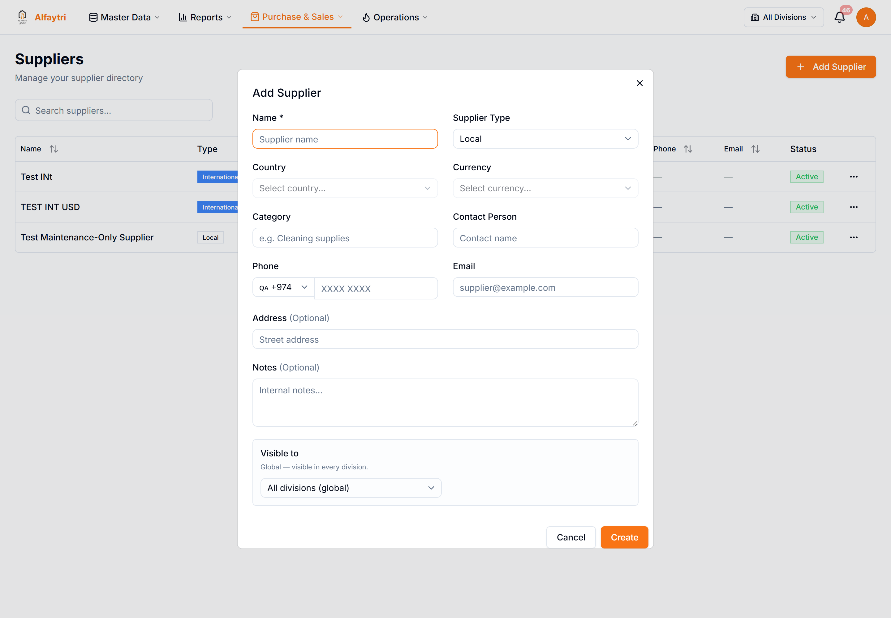

## 3.2 Purchase Orders

**Purchase & Sales → Purchase Orders**

The heart of buying. The top cards summarise everything: **Total POs**, **Pending Approval**, **In Receival**, and **Total Value**. The tabs (**All / RFQ / Draft / Confirmed**) and the filter row (search, status, supplier, date range, receival, payment) help you find a specific order.

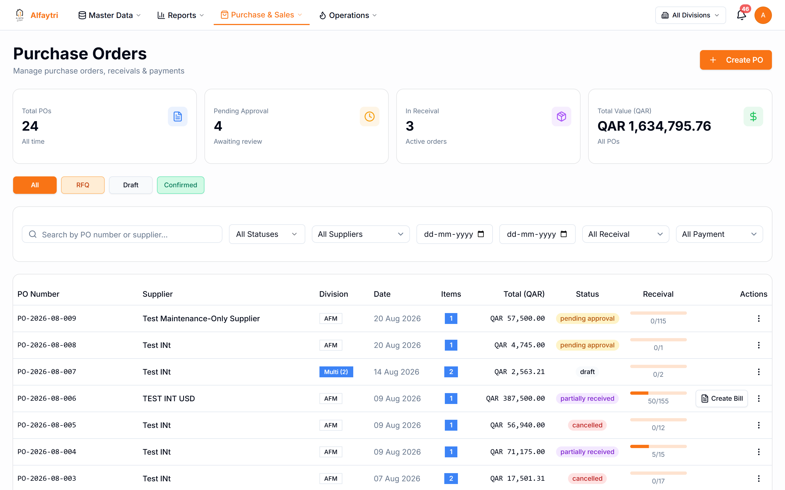

Each row shows the PO number, supplier, division, date, item count, total, **status**, and a **receival progress bar** (e.g. `50/155` means 50 of 155 units received).

**A purchase order moves through these statuses:**

- **Draft** — being prepared; not yet sent for anything.
- **RFQ** — a request for quotation sent to the supplier.
- **Pending approval** — submitted and waiting for an approver (see 3.3).
- **Confirmed** — approved and active; ready to receive against.
- **Partially received / Received** — goods are coming in (tracked by the progress bar).
- **Cancelled** — voided.

Click any row to open the **PO detail** — line items, receival progress, payments, and the actions available for its status.

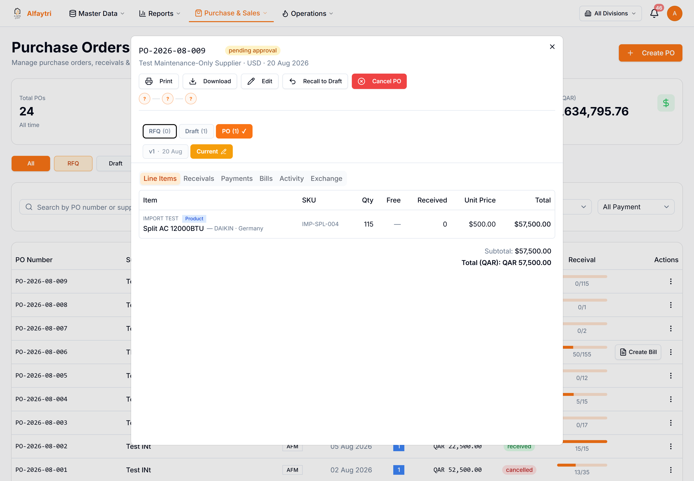

**To create a purchase order:** click **Create PO** (top right), choose the supplier and division, add item lines with quantities and prices, choose a payment term, and either save as **Draft** or **Submit for Approval**. Once approved and confirmed, you receive against it and then bill it.

> **Who can do this:** creating and submitting POs needs the *Purchase Orders* permission; the **Create Bill** shortcut on a received PO needs the *Bills* permission.

## 3.3 Approvals

**Purchase & Sales → Approvals**

POs above a value threshold need sign-off before they become active. This page lists everything waiting on an approver.

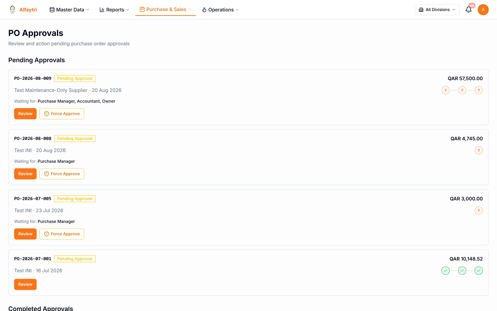

Open an item to review it, then **Approve** or **Reject** (a rejection asks for a reason). Approved POs become **Confirmed**; rejected ones go back to the buyer.

## 3.4 Receivals

**Purchase & Sales → Receivals**

Record goods physically arriving against a confirmed PO. This is what moves stock into your warehouse and drives the PO's receival progress bar.

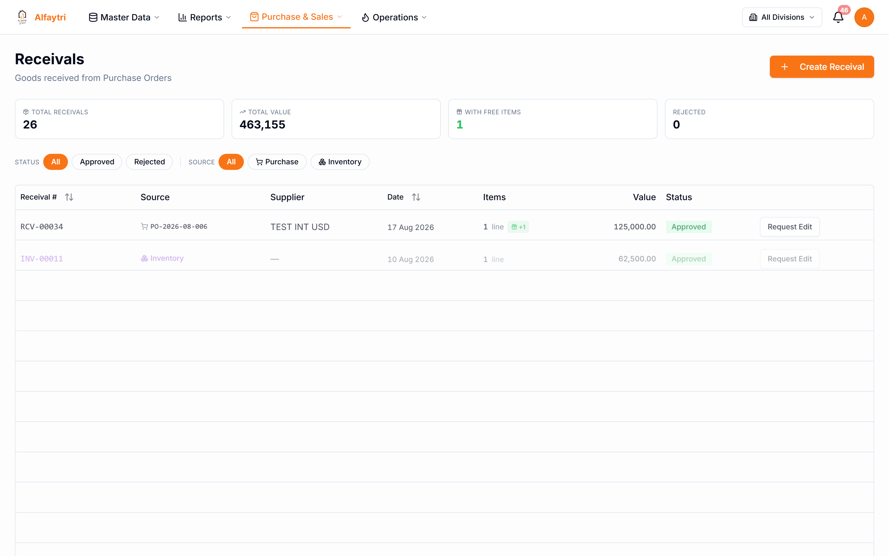

Create a receival against a PO, enter the quantities actually received (you can receive partially, more than once, until the PO is complete), and confirm. Received stock becomes available in inventory at its landed cost.

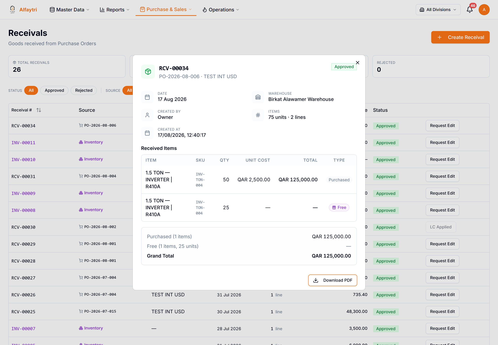

## 3.5 Bills

**Purchase & Sales → Bills**

The supplier's invoice to you. A bill records what you owe and feeds the **Money Going Out** and **Accounts Payable** figures.

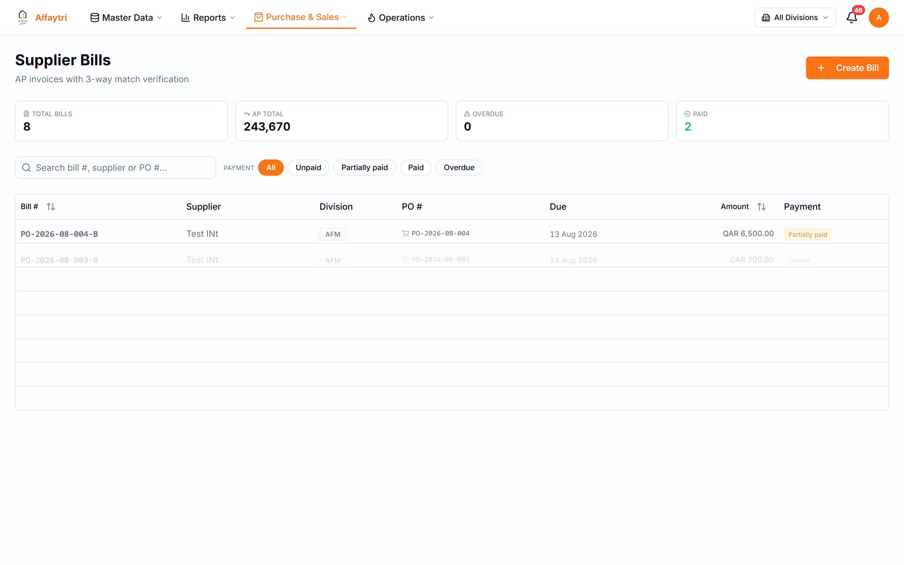

Create a bill from a received PO (or from the **Create Bill** shortcut on the PO list), match it to the received quantities, and record payments against it over time. Outstanding bills appear in the Aging Report (3.8).

## 3.6 Returns

**Purchase & Sales → Returns**

When goods have to go back to the supplier, raise a purchase return.

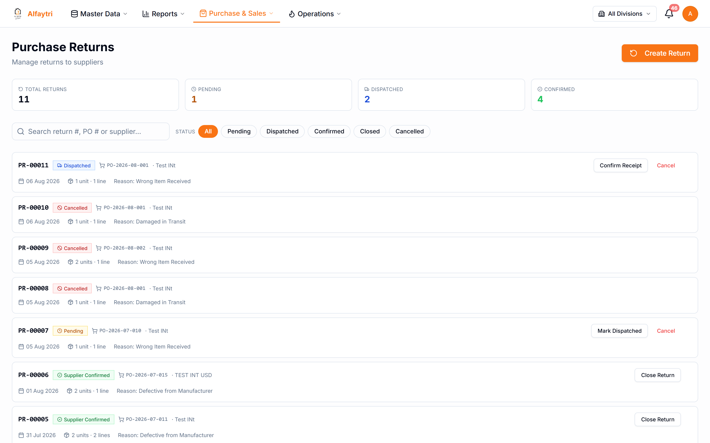

A return records the items and quantities going back and links to the original PO. It pairs with a **Debit Note** (3.7) to adjust what you owe the supplier.

## 3.7 Debit Notes

**Purchase & Sales → Debit Notes**

The financial side of a supplier return — a debit note reduces what you owe for the returned goods.

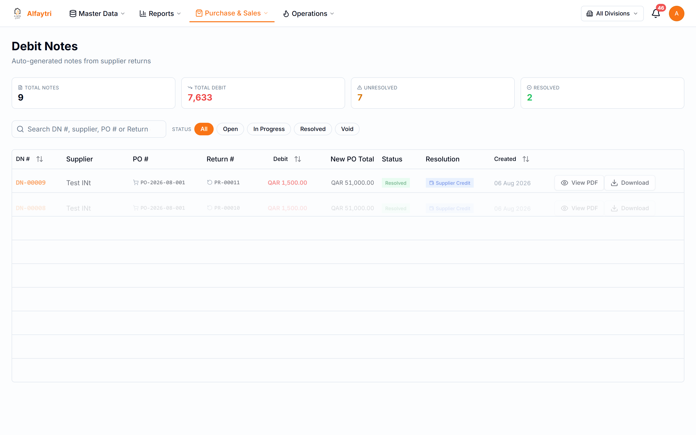

Debit notes are usually raised from a purchase return and applied against the supplier's outstanding bills.

## 3.8 Aging Report

**Purchase & Sales → Aging Report**

Shows what you owe suppliers, grouped by how overdue it is (current, 30 / 60 / 90+ days). Use it to decide who to pay next and to spot overdue balances.

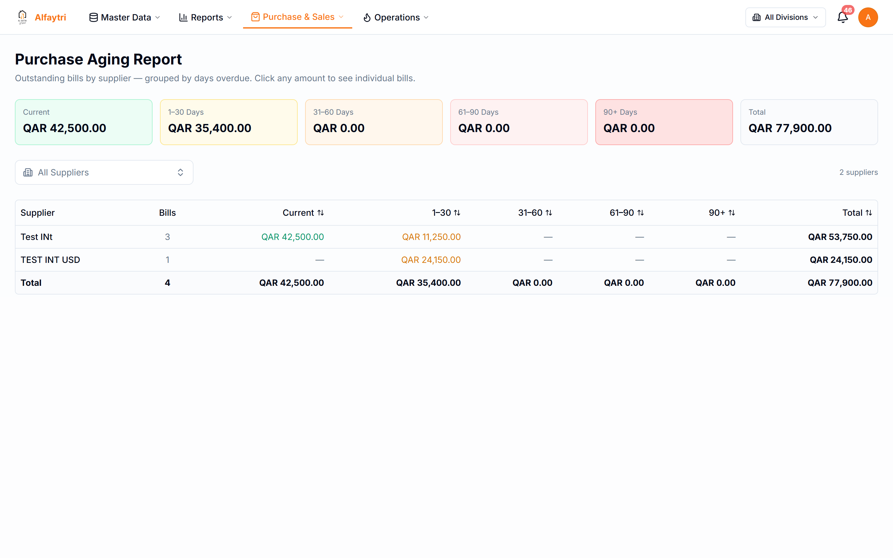

## 3.9 Shipments

**Purchase & Sales → Shipments**

Track goods in transit from your suppliers. Add a shipment with its carrier tracking number and the system follows its progress automatically, so you can see where an incoming order is without chasing the supplier.

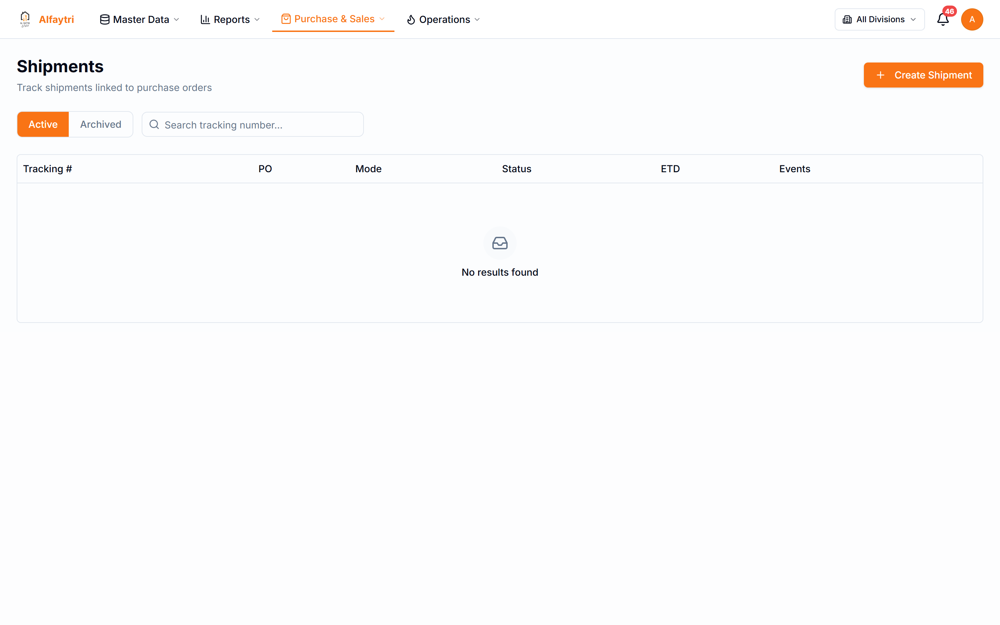

## 3.10 Landed Costs

**Purchase & Sales → Landed Costs**

Freight, customs, and clearing charges usually arrive *after* the goods. A landed cost spreads those charges across the items on one or more receivals — in proportion to their value — so each item's stock cost reflects what it *really* cost to land, not just the supplier's price.

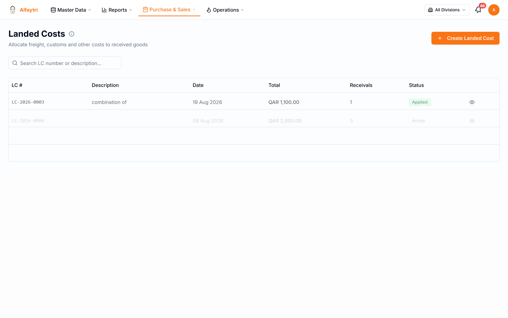

Create a landed cost, attach the receival(s) it applies to, enter the total charge, and apply it. Units still in stock have their cost bumped up; units already sold get the extra cost booked to the P&L automatically.

## 3.11 Dead Stock Report

**Purchase & Sales → Dead Stock Report**

Highlights stock that hasn't moved in a while — slow-moving and non-moving items tying up cash on the shelf. Use it to decide what to discount, return, or stop reordering.

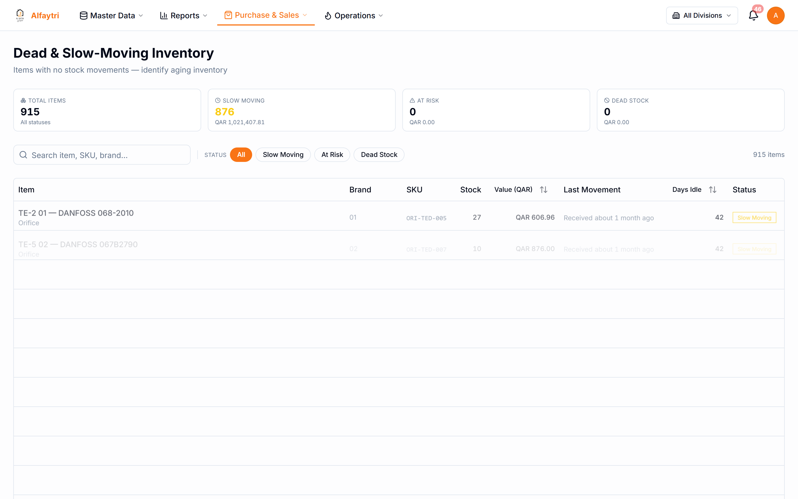
