# 4. Sales

Selling follows one path, mirroring Purchase:

**Customer → Sale Order → Approval → Delivery → Invoice**, with **Returns / Credit Notes** when goods come back, **Warranties** issued automatically on delivery (and **Claims** when a customer reports a fault), and **Customer Statement / Aging** to track what you're owed.

Everything is under the **Purchase & Sales** menu.

## 4.1 Customers

**Purchase & Sales → Customers**

Your client list, including their credit group and contact details.

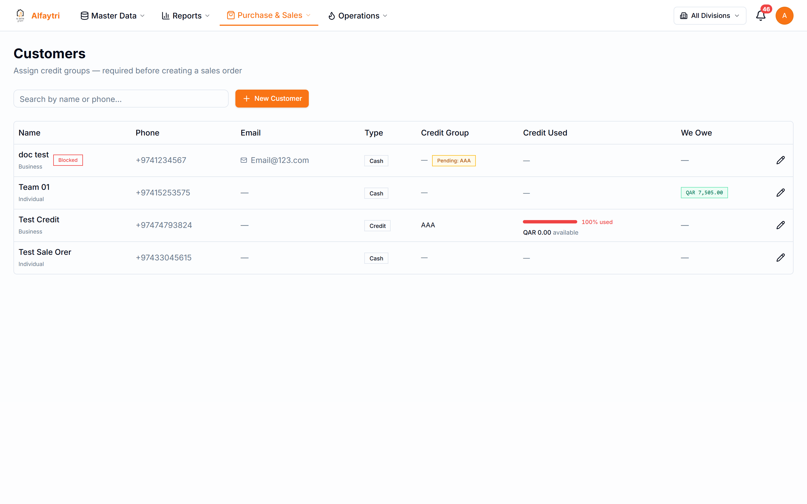

Add a customer before raising a sale order to them. A customer's **credit group** sets their credit limit — orders that would push them over the limit are diverted to approval (see 4.3). Changing a customer's credit group to a higher-limit tier needs its own approval.

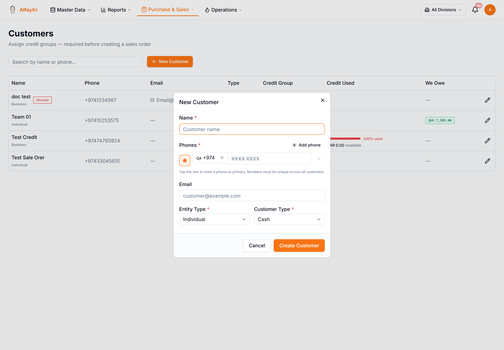

## 4.2 Sale Orders

**Purchase & Sales → Sale Orders**

Where customer orders live, from quotation through to delivery. Summary cards and filters work just like the Purchase Orders page.

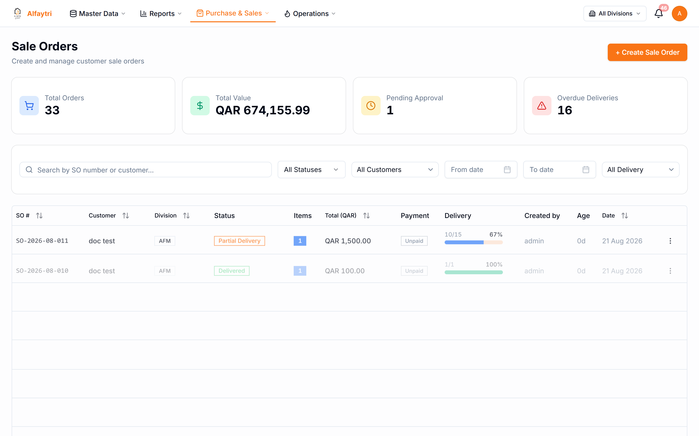

**A sale order moves through:** draft/quotation → **pending approval** (if over the customer's credit limit or a value threshold) → **confirmed** → **delivered** → **invoiced**.

Click any row to open the **SO detail** — line items, delivery progress, payments, invoices, and the status-appropriate actions.

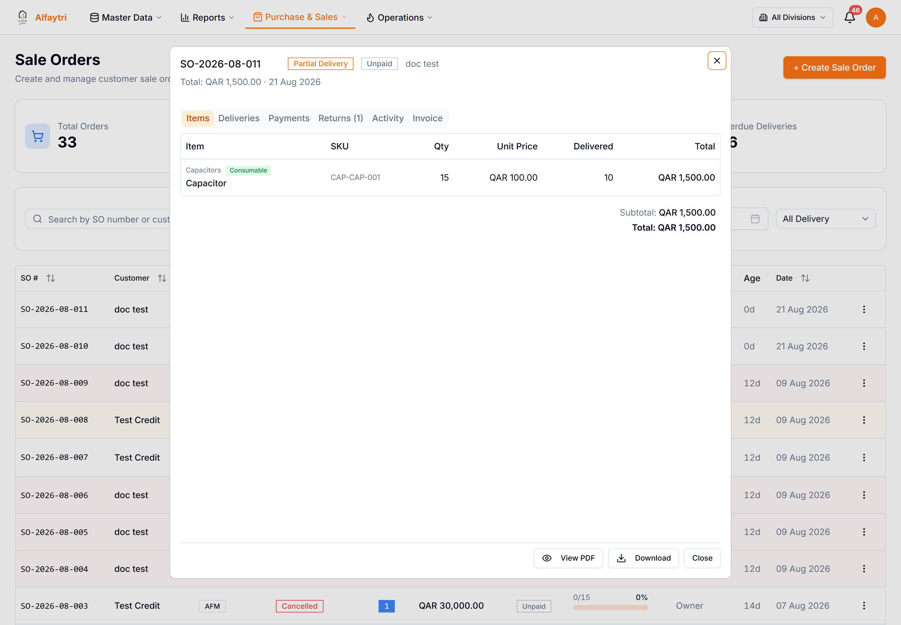

**To create an order:** click **Create Sale Order**, choose the customer and division, add item lines with quantities and prices, and submit. If the customer is within their credit limit it confirms directly; if not, it's sent for approval automatically. Once confirmed you raise a **delivery**, and invoicing follows.

> **Who can do this:** creating and confirming SOs needs the *Sale Orders* permission. Confirming an over-limit order always routes through credit approval — it can't be forced through directly.

## 4.3 Approvals

**Purchase & Sales → Approvals**

Sale orders waiting for sign-off — typically because they exceed a value threshold or the customer's credit limit.

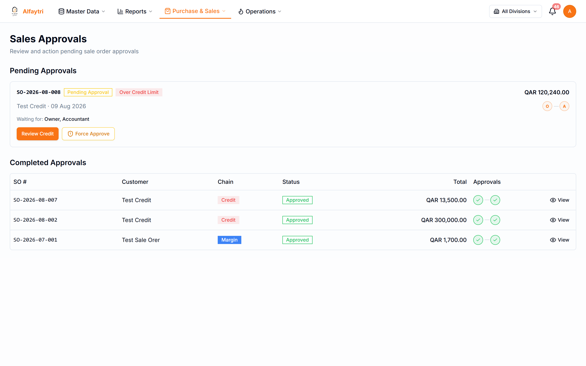

Open an item, review it, and **Approve** or **Reject** (rejection needs a reason).

## 4.4 SO Invoices

**Purchase & Sales → SO Invoices**

Invoices raised from delivered sale orders. This drives **Money Coming In** and **Accounts Receivable**.

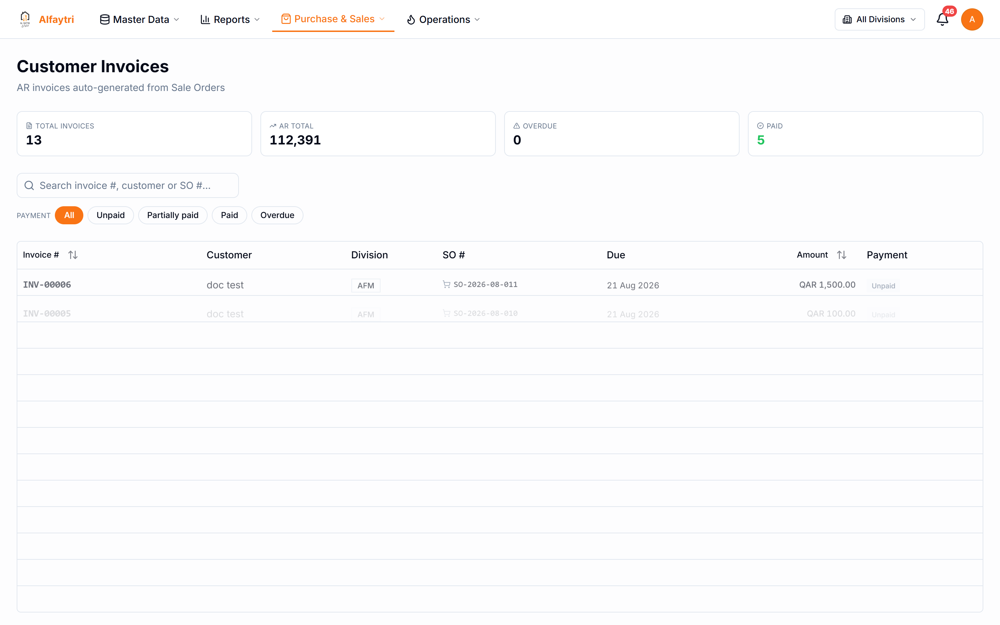

Open an invoice to view it, download the PDF, and record customer payments against it over time. Outstanding invoices appear in the Aging Report (4.10) and the Customer Statement (4.9).

## 4.5 Deliveries

**Purchase & Sales → Deliveries**

Records goods handed to the customer. Completing a delivery deducts stock and is what triggers **invoicing** and **warranty issuance**.

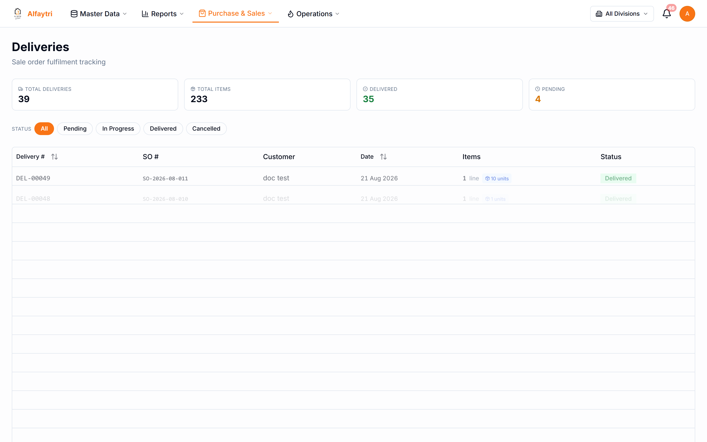

**To deliver:** open a confirmed order's delivery, confirm the quantities delivered, and mark it delivered. If any delivered item carries a warranty policy, its **warranty certificate opens automatically** so you can print/hand it to the customer (there's also a manual **Print Warranty Certificate** button on the delivery).

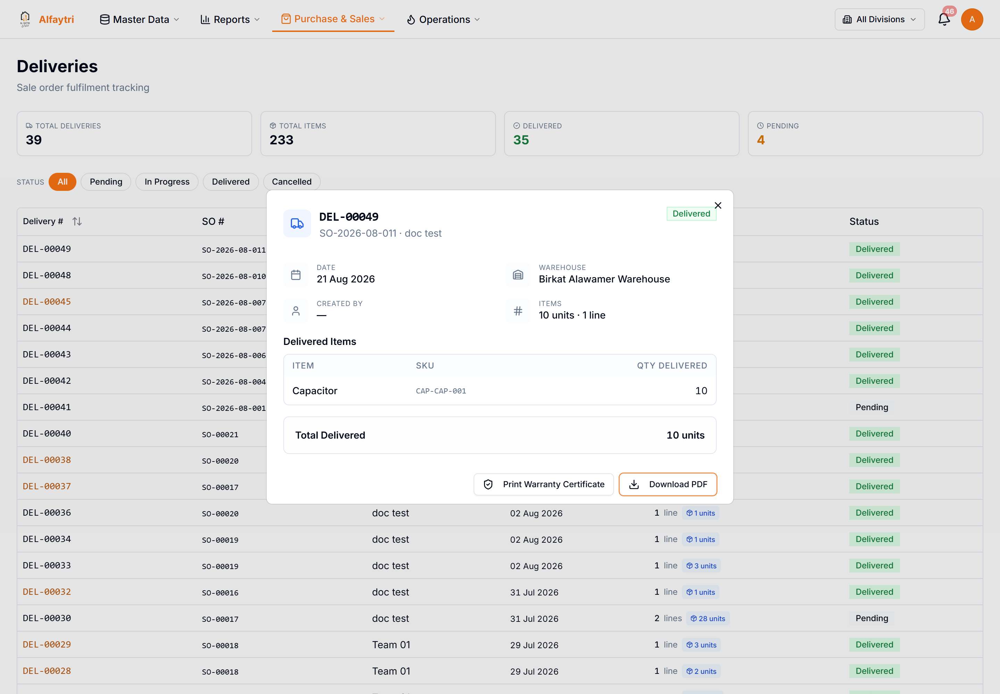

## 4.6 Returns

**Purchase & Sales → Returns**

When a customer sends goods back. A return records the items and quantities, goes through inspection, and resolves as a **refund**, **replacement**, or **store credit** — with damaged units optionally sent for repair or written off.

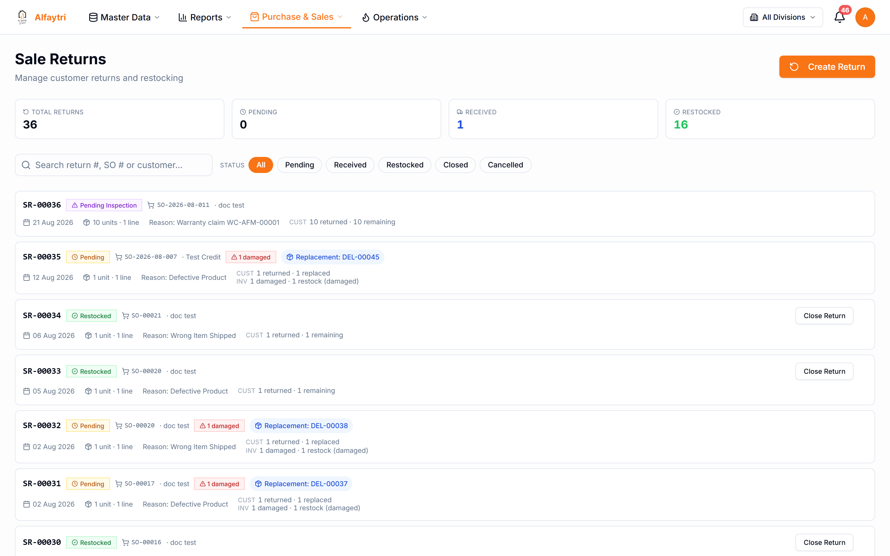

A return created from a **warranty claim** shows a banner linking back to the claim and the warranty's remaining coverage.

## 4.7 Credit Notes

**Purchase & Sales → Credit Notes**

The financial side of a customer return or an invoice adjustment — a credit note reduces what the customer owes and can be applied against their invoices.

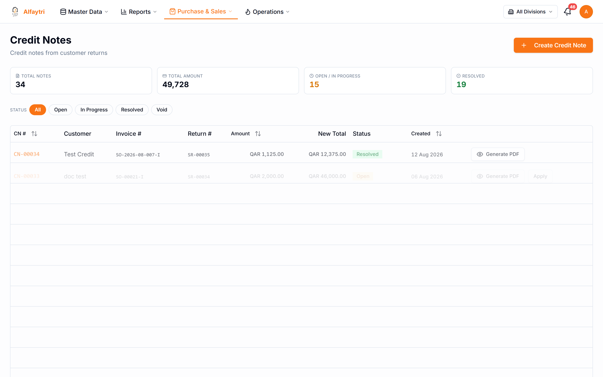

Open one to see its detail — the amount, its source, and how it's been applied or redeemed.

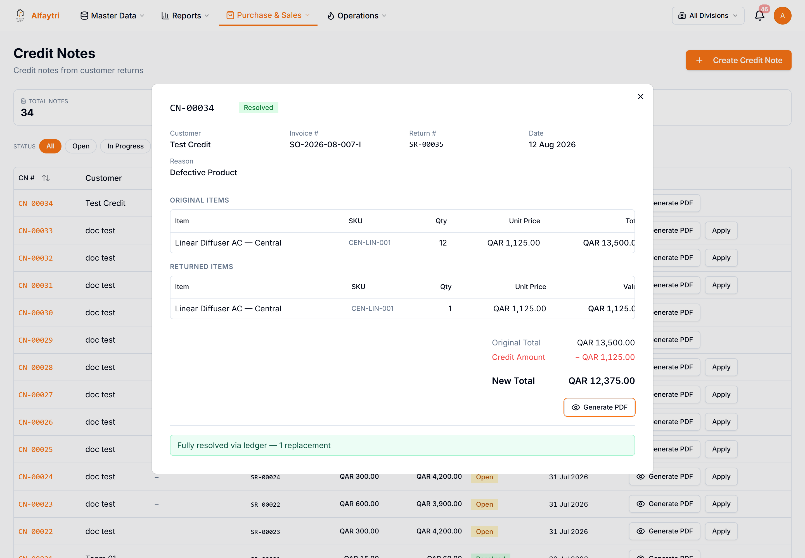

## 4.8 Warranties & Claims

**Purchase & Sales → Warranties**

Every warranty-covered item creates a **warranty record** automatically when its delivery is completed. This page is the register of all issued warranties, plus the **Claims** workflow.

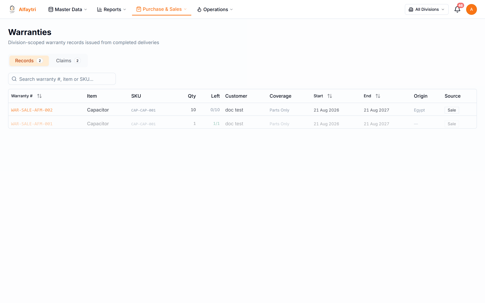

**Records tab** — every issued warranty: warranty number, item, coverage, start/end dates, country of **origin**, and **how many units are still covered** (a warranty can be claimed in parts). Open one to see its full detail and to **File a claim**.

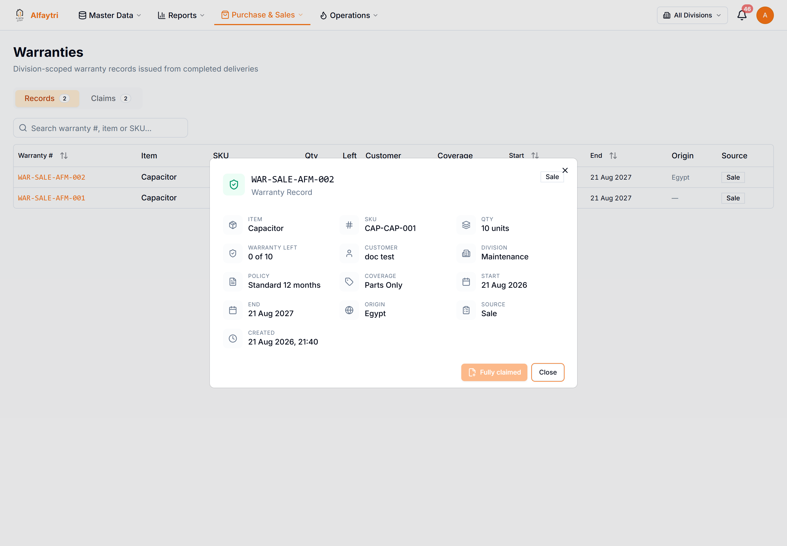

**Claims tab** — the full claim lifecycle for sale warranties:

1. **File a claim** from a warranty record — enter the **quantity** being claimed (up to what's still covered) and describe the issue.
2. **Assess** the claim — **Cover** it or **Reject** it (a rejection needs a reason). Rejecting frees those units back to the warranty.
3. **Start resolution** on a covered claim — this creates a **warranty return** for the claimed quantity, which you then resolve in the Returns page (inspection → refund / replacement / store credit).
4. The claim **auto-resolves** once that return is completed, showing the resolution type and any linked credit note.
5. **Void** — a claim filed in error can be voided (with a reason) at any point before it's resolved; if it already created a return, voiding cancels that return too (as long as it hasn't been processed).

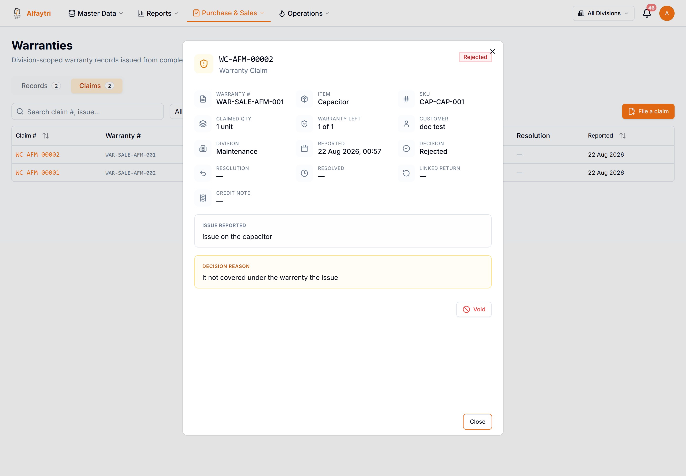

> **Who can do this:** viewing warranties needs *Warranties* view; filing/assessing/resolving/voiding claims needs *Warranty Claims* manage. Sending a unit for repair alone does **not** resolve a claim — a customer outcome (refund/replacement/credit) does.

## 4.9 Customer Statement

**Purchase & Sales → Customer Statement**

A per-customer ledger of invoices, payments, credit notes, and running balance. Pick a customer to see their statement and download it.

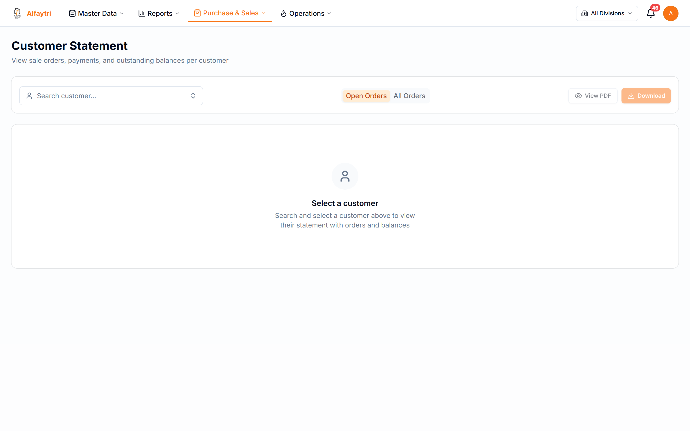

## 4.10 Aging Report

**Purchase & Sales → Aging Report**

What customers owe you, grouped by how overdue it is (current, 30 / 60 / 90+ days). Use it to chase overdue balances.

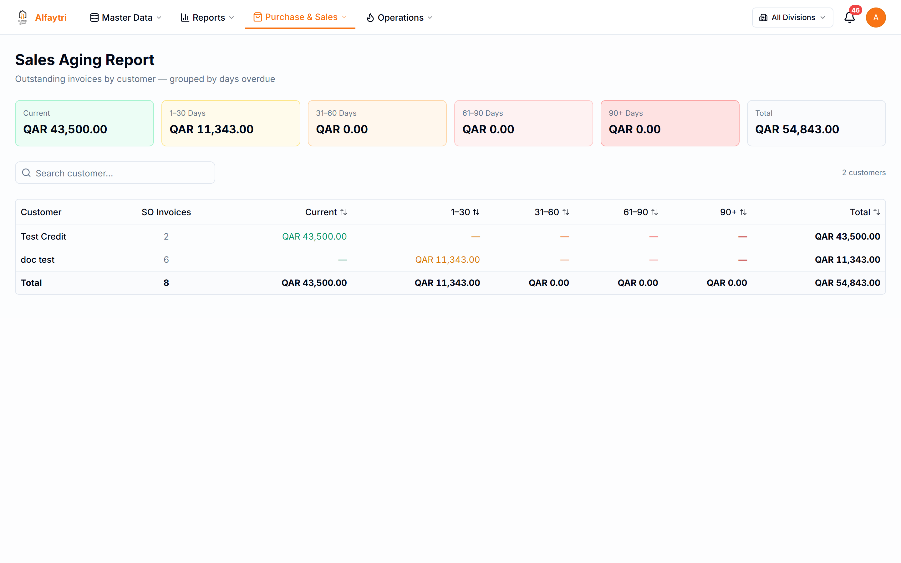
