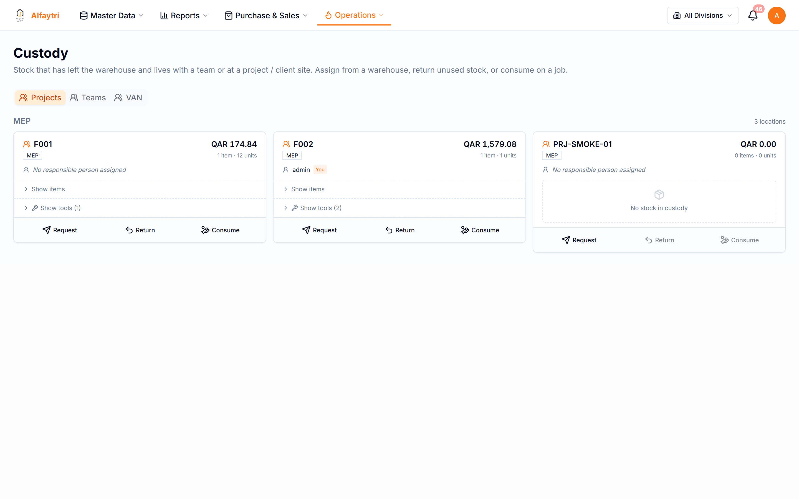
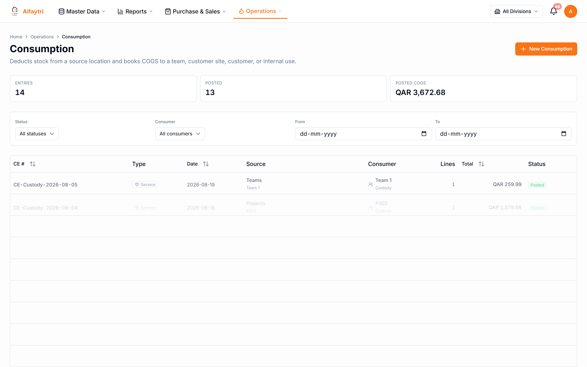
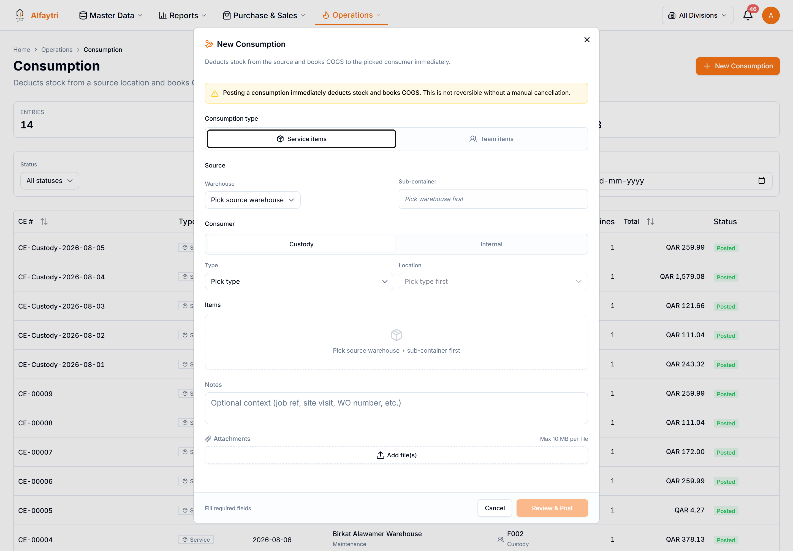
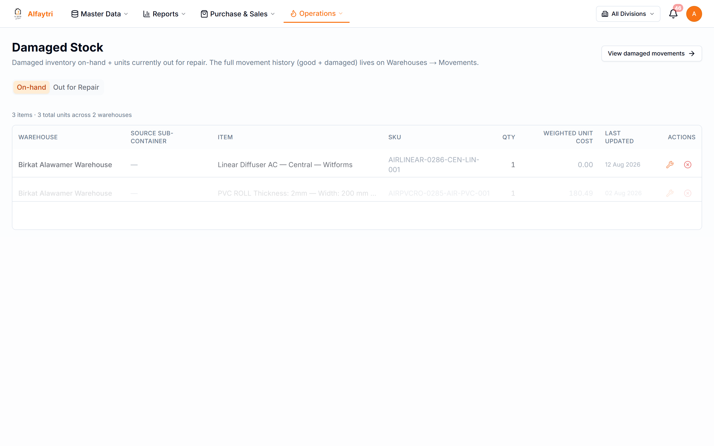
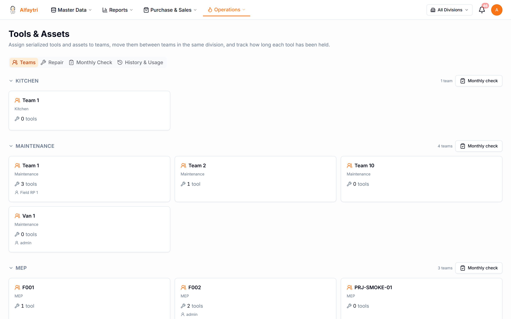
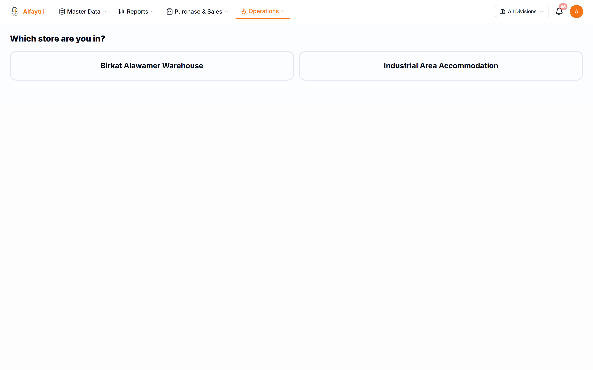

# 5. Operations

Operations covers what happens to stock day to day inside the business — items handed to teams, items consumed on jobs, damaged stock, tools and assets, and a simple picture-based transfer tool for warehouse staff.

All of these are under the **Operations** menu.

## 5.1 Custody

**Operations → Custody**

Tracks stock handed to a team or person (custody), separate from warehouse stock. Use it to see who is holding what, and to move or return items.

- **Assign / move** stock into a team's custody.
- **Return** stock from custody back to a warehouse.
- Team-item consumption (below) draws from custody holdings.

## 5.2 Consumption

**Operations → Consumption**

Records stock used up on service jobs — the items leave inventory and their cost posts to the job/P&L. There are two tabs:

- **Service items** — general consumables used on a service.
- **Team items** — items consumed from a specific team's custody.

**To record consumption:** click **New Consumption**, choose the mode, pick the item(s) and quantities and the source, and save. (This is also how service warranty work is currently recorded — as consumption.)

## 5.3 Damaged Stock

**Operations → Damaged Stock**

Stock set aside as damaged — either on hand (awaiting a decision) or out for repair with a vendor.

From here damaged units can be written off, restocked, or sent to a repair vendor and later returned (usable) or scrapped.

## 5.4 Tools & Assets

**Operations → Tools & Assets**

Serial-tracked tools and equipment (as opposed to consumable stock). Each unit has a lifecycle — New / Used / Repaired — and a custody trail.

- Assign a tool to a team and return it later.
- Run **condition checks** (Good / Bad / Repair) and monthly check sessions.
- Send a tool for repair (to a vendor bucket) and bring it back as repaired, or scrap it (which retires it and posts its cost to the P&L "Scrap & Defective" line).

## 5.5 Picture Transfer

**Operations → Picture Transfer**

A simplified, picture-first Send / Receive tool designed for warehouse staff who need a fast visual way to move stock between locations without navigating the full transfer screens.

