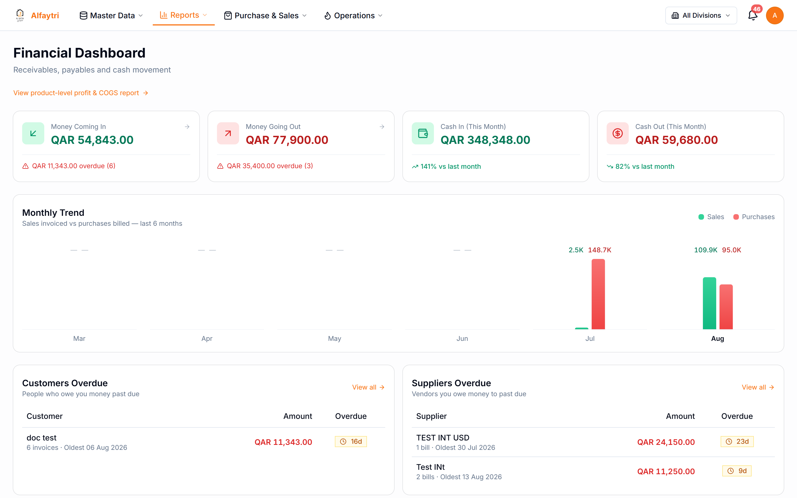
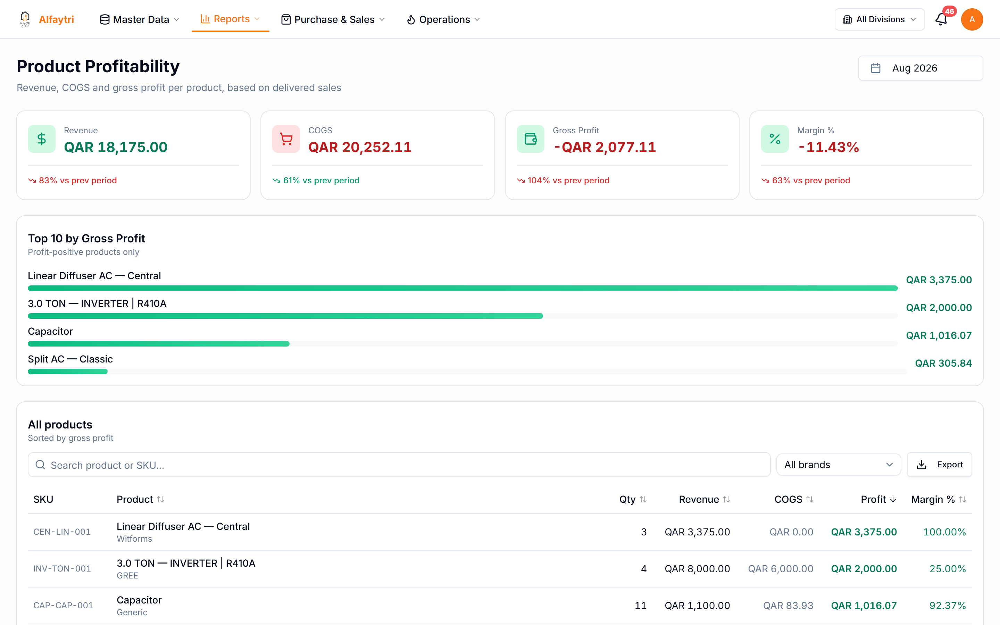
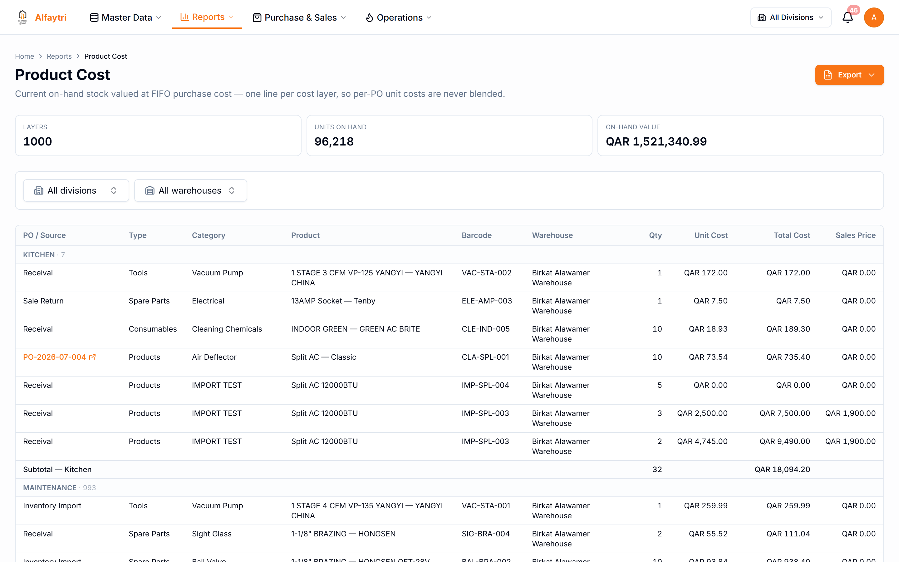
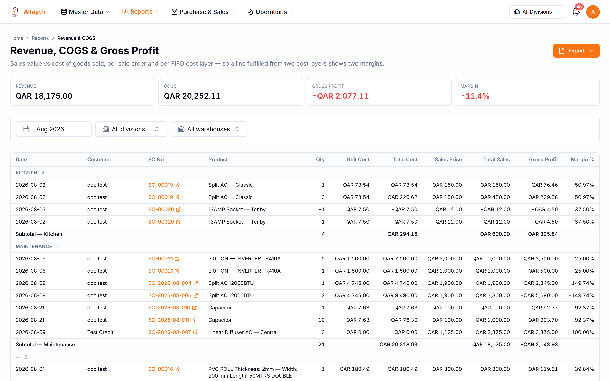
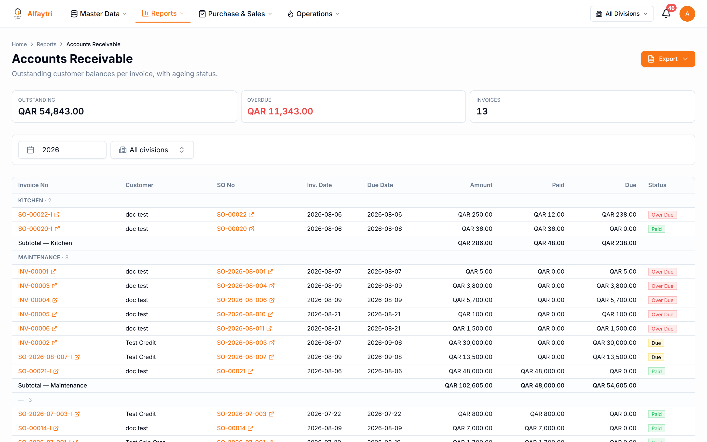
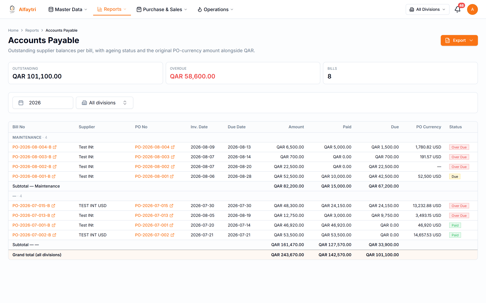
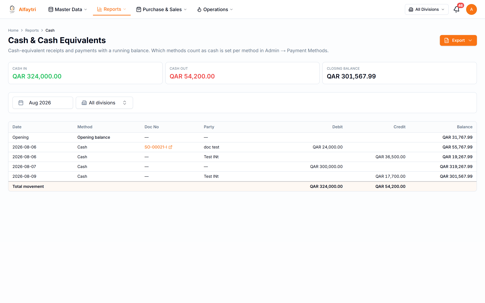
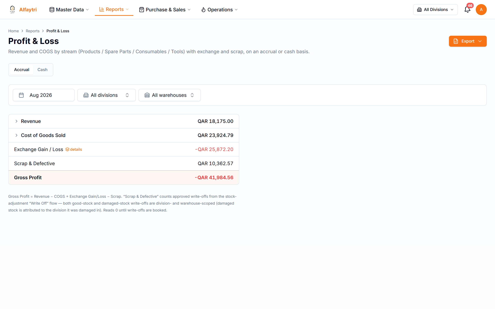
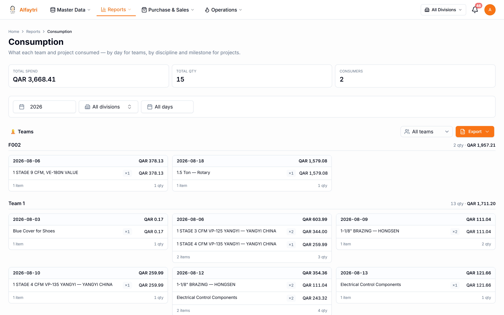

# 6. Reports

The Reports menu is where the numbers come together — financial health, what each product earns, and where cash sits. Most reports let you filter by division and date range, and export to Excel.

> **Who can do this:** each report has its own view permission, and the financial figures are hidden from roles without the relevant cost/financial permission.

## 6.1 Financial Dashboard

**Reports → Financial Dashboard**

A one-screen financial snapshot — income vs. expense, cash position, and headline figures — for a chosen period.

## 6.2 Product Profitability

**Reports → Product Profitability**

What each product (or category) actually earns: revenue, cost of goods sold, and margin. Drill in to see the contribution of individual items. Use it to spot your best and worst performers.

## 6.3 Product Cost

**Reports → Product Cost**

The current cost picture per item — useful for checking landed cost and pricing decisions.

## 6.4 Revenue & COGS

**Reports → Revenue & COGS**

Sales revenue against cost of goods sold over the period — the top of the profit calculation, broken down so you can see what's driving it.

## 6.5 Accounts Receivable

**Reports → Accounts Receivable**

Everything customers owe you, aged by how overdue it is. This is the money-in side; pair it with the Sales Aging Report to chase payment.

## 6.6 Accounts Payable

**Reports → Accounts Payable**

Everything you owe suppliers, aged the same way — the money-out side. Use it to plan payments.

## 6.7 Cash & Cash Equivalents

**Reports → Cash & Cash Equivalents**

Where your cash actually is and how it has moved — actual receipts and payments, as opposed to invoiced/billed amounts.

## 6.8 Profit & Loss

**Reports → Profit & Loss**

The full P&L for the period: revenue, cost of goods sold (including retroactive landed cost and consumption), expenses, and the resulting profit — division-scoped, with drill-downs into each line.

## 6.9 Consumption

**Reports → Consumption**

What has been consumed on jobs over the period and its cost — the reporting view of the Operations → Consumption activity.

